# A guide to scraping sites with xpath selectors

For this example we'll be scraping `JustWatch.com`. Screenshots have been cropped to reduce copyrighted materials on screen and for brevity

# 0. Jargon + tools
## Browser Developer Tools
We'll be making heavy use of developer tools. There are alternatives but this is my preferred way of doing things. This is built into your browser

On Chrome/ FireFox, I prefer `F12`.

[More options for chrome](https://developer.chrome.com/docs/devtools/open), [Firefox](https://firefox-source-docs.mozilla.org/devtools-user/). Firefox Developer Edition is **not** required

## JSON viewer for Chromium
https://chromewebstore.google.com/detail/json-viewer/efknglbfhoddmmfabeihlemgekhhnabb

This has been imperative for viewing JSON documents in Chrome, it is completely unnecessary in Firefox but helps prettify it immensely

## regex
regex is commonly used in scrapers as a quick and easy clean. Sites like [regexr](https://regexr.com/) and [regex101](https://regex101.com/) are immensely helpful for building but especially for testing regex patterns.

If you're not as experienced, you might want to lean on an LLM for developing patterns, but do test on those sites

## Selector resources
- xpath cheat sheet - https://devhints.io/xpath
- css selector cheat sheet https://devhints.io/css (personal preference for iteration)
- stash scraper development docs https://docs.stashapp.cc/in-app-manual/scraping/scraperdevelopment/

## API Tester
For JSON APIs (not covered) You'll want a non-browser api tester. This isolates cookies, extensions etc...

Some popular clients that also support graphql are:
- [Postman](https://www.postman.com/downloads/)
- [Insomnia](https://insomnia.rest/download)
- [Yaak](https://yaak.app/)
- [Bruno (untested)](https://www.usebruno.com/downloads)

[curl](https://curl.se/download.html) is also recommended to test WAFs.

## VPN subscription
While not strictly necessary, it is very very helpful to test geo-location blocks.

If you're a backer, [there is a community proxy available](https://discourse.stashapp.cc/t/http-s-proxy-for-backers/4071). Otherwise see [tangent/vpn](./tangent/vpn.md) for my thoughts.

# 1.1 Reconnaissance - Limitations
Before scraping a site, it's imperative to realize the limitations you're up against. These broadly fall into 3 categories

## 1. Anti-Bot/ WAF (Web Application Firewall)
The largest one of these is cloudflare. This can be inspected in [Developer Tools](#browser-developer-tools) -> Network. Click on the topmost entry -> Headers.

We are looking specifically for `Server: cloudflare`, but getting hit with a cloudflare challenge is also very telling. Similar proof of work blocks like [Anubis](https://anubis.techaro.lol/)

might warrant a shift into a python scraper

## 2. Geo-Restrictions/ Age Verification

Quite easy to spot. If you're not in a restricted region, [VPN](#vpn-subscription) to a restricted region like [Dallas/ Austin]/Texas/USA usually works. While some can be bypassed, it's usually easier to completely circumvent by changing IP to an unrestricted location.

## 3. JavaScript

JavaScript can make sites pretty, but unfortunately only renders in the browser (or with useCDP). Usually the data is already embedded elsewhere in the code, so avoiding it is ideal. When scraping a site, it's advised to turn off JavaScript. This can be done with [uBlock Origin](https://github.com/gorhill/uBlock?tab=readme-ov-file#ublock-origin-ubo) with the [No scripting](https://github.com/gorhill/uBlock/wiki/Per-site-switches#no-scripting) button or manually, in [chromium](./tangent/disable-js.md). The site might not look right but is very helpful when testing selectors (especially images)

# 1.2 Reconnaissance - Alternatives
Before going too far, be aware of possible alternatives. This can include
- Checking for [existing CommunityScrapers](https://stashapp.github.io/CommunityScrapers/)
- Other resources on [Github](https://github.com/search?q=JustWatch%20scraper&type=repositories). A search for `{website} scraper` or `{website} api` usually does the trick
- Searching for public APIs. In this case there is [api.justwatch.com](https://apis.justwatch.com/docs/api/) which we will pretend doesn't exist.

## Private APIs/ fetch
A lot of websites have private APIs that they call internally from the website. If these are exposed publicly, they can be utilized. To discover these, Open up [Developer Tools](#browser-developer-tools) -> Network -> `Fetch/XHR`. You can see an example of this on [stash CommunityScraper index](https://stashapp.github.io/CommunityScrapers/). We can see an XHR call to [`scrapers.json`](https://stashapp.github.io/CommunityScrapers/assets/scrapers.json
) which contains all the goodies that one might want to access instead of scraping the WebUI.

## ld+json

the [ld-json](https://json-ld.org/) spec is amazing for scraping. It is covered in the [advanced scraping guide](tangent//advanced-scraping.md) (mirror of [discourse](https://discourse.stashapp.cc/t/advanced-yaml-scraping/4056))

## meta-tags

inspect the page in [Developer Tools](#browser-developer-tools). Head into Elements and open up the `<head>` dropdown. You'll see a plethora of `<meta>` elements.

These are used for SEO and usually contain valuable scrape-able information in a digestible, accessible format (usually amazing for images).

# 2.0 Scraper Planning
We need to identify what elements we're going to scrape before trying to extract them. [stash docs](https://docs.stashapp.cc/in-app-manual/scraping/scraperdevelopment/#object-fields) is a great resource for all possible values. Identify all elements you want to scrape and see if the page provides them. In this case we'll scrape it as a `Scene`.

We move forward with the following assumptions
- No geoblocks
- No WAF/ Cloudflare (no python needed)
- No alternatives (xpath is the best way forward)

For this example,
```diff
- Code
+ Date
+ Details
+ Director
- Groups (see Group Fields)
+ Image
+ Performers (see Performer fields)
- Studio (see Studio Fields)
+ Tags (see Tag fields)
+ Title
+ URLs
```

# 2.1 Scraper construction loop
We'll be going through this loop quite a few times as a demo, so I'll leave most of the details in the first block. As a test we'll be scraping Project Hail Mary: `https://www.justwatch.com/us/movie/project-hail-mary`.

a tl;dr of the cycle is
- Find identifying property
- Search in Developer Tools -> Elements to see if it brings up multiple results
- Select something in it/ above it to make it more specific
- Repeat until you only get one result

## Title
We know the title, so we first open [Developer Tools](#browser-developer-tools), head to elements, hit `Ctrl + F` for a search bar and type in the title: `project hail mary`

We see a couple of matches in `<meta>` but they're all appended with "streaming: where to watch online" or similar junk so we avoid those. We do see a ld-json block but will ignore that unless strictly necessary. Eventually we end up with the following text block within the `<h1>`

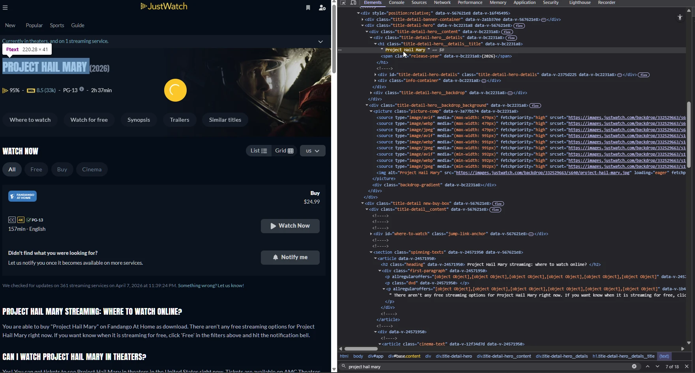

We want to step immediately above that and look for any distinctive features of the element

```html
<h1 class="title-detail-hero__details__title" data-v-bc2231a8="">
  Project Hail Mary
  <span class="release-year" data-v-bc2231a8="">(2026)</span>
</h1>
```

We see that it's an `h1` header and has the css class of `hero__details__title`. Let's construct a selector and see how it works.

first we can test by just h1 - in xpath this will be `//h1`, in css `h1`. If we paste this in the search bar, we can see the matches. One result. Nice. That's our selector, we can move on
```yml
  Title: //h1
```

## Date
If we have a rough idea of the date or year, just throw it into search and see whats comes up. 

Unfortunately we have 43 results. many of them seem to be errors or irrelevant. This one seems to be promising, let's try the same approach

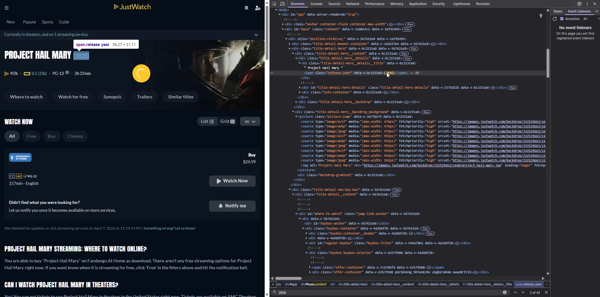

```html
<h1 class="title-detail-hero__details__title" data-v-bc2231a8="">
  Project Hail Mary
  <span class="release-year" data-v-bc2231a8="">(2026)</span>
</h1>
```

Craft a selector for `span`, xpath: `//span` and... 176 results.

Let's refine it by adding on the class. xpath: `//span[@class="release-year"]` or css: `span.release-year`.

Nice. one result. Let's move on

```yml
  Date: //span[@class="release-year"]
```

## Details
For details, we want to grab the synopsis. Let's quickly scan the page visually. Let's grab the first sentence and throw it into search again.

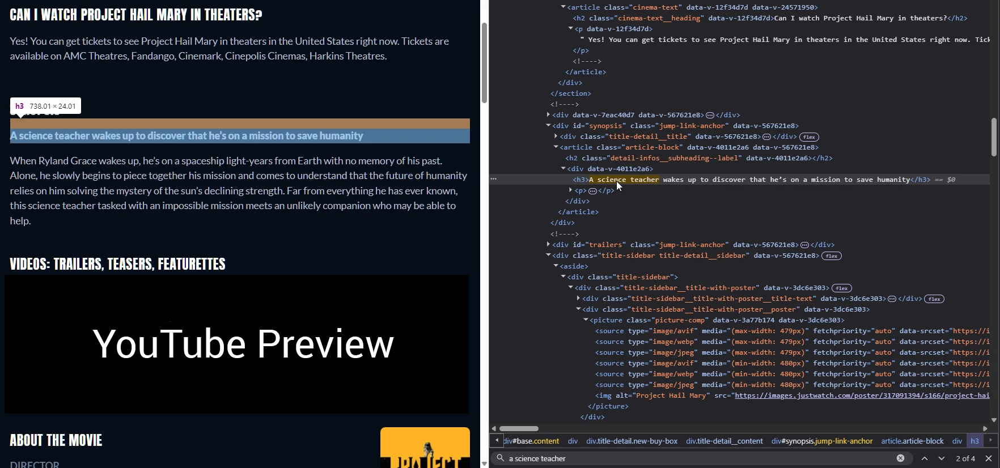

4 results - ld-json, `window.__DATA__` and `window.__APOLLO_STATE__`. Let's ignore those for now and focus on xpath. We can see it's in a block called "synopsis", so let's work from there (truncated for space)

```html
<div id="synopsis" class="jump-link-anchor" data-v-567621e8="">
  <div class="title-detail__title" data-v-567621e8="">
    <h2 class="title-detail__title__text" data-v-567621e8="">Synopsis</h2>
  </div>
  <article class="article-block" data-v-4011e2a6="" data-v-567621e8="">
    <h2 class="detail-infos__subheading--label" data-v-4011e2a6=""></h2>
    <div data-v-4011e2a6="">
      <h3>A science teacher ...</h3>
      <p>When Ryland Grace wakes up, ... companion who may be able to help.
      </p>
    </div>
  </article>
</div>
```

We know we want to include `A science teacher` but not `Synopsis`. Let's try to capture the `article-block` within `synopsis`

Construct a selector for `article-block`, xpath: `//article` and we get 3 blurbs. Adding on the class (`//article[@class="article-block"]`) would solve this but let's try stepping down from synopsis instead. 

First create a selector for `synopsis`, xpath `//div[@id="synopsis"]` or css `div#synopsis`. One result. so let's continue

We want to descend within this to article block, so let's first start with a generic. `//div[@id="synopsis"]` + `//article`.

𐠒: `//` is actually a selector that allow for multiple levels, or anything before, so we usually want it at the beginning unless we want a really long preceding path. If you wanted to only include the tagline, we would create a selector to match everything in between. This would look like
`//div[@id="synopsis"]/article/div/h3` since we need to step down into every single element. We can shorten this by replacing the `/article/div` path with `//`. This would create `//div[@id="synopsis"]//h3` which is less accurate but works for this case.

We can combine these two selectors now for `//div[@id="synopsis"]/article` - we drop the second `/` from the prefix of article. Since we have multiple results, let's do some post processing to mimic the newlines on the page. In this case let's use the [`concat`](https://docs.stashapp.cc/in-app-manual/scraping/scraperdevelopment/#post-processing-options) post-processing option. Since we're adding post-processing, our selector has to be under `selector` instead of just `Details`. The `\n\n` will do the same as two enters and place it on the next line.

```
A science teacher ...⏎
⏎When Ryland Grace wakes up, ... companion who may be able to help.
```

If we wanted an empty line in between, add another `\n` to make 3

```
A science teacher ...⏎
⏎
⏎When Ryland Grace wakes up, ... companion who may be able to help.
```

```yml
  Details:
    selector: //div[@id="synopsis"]/article
    concat: \n\n\n
```

## Director
Let's do a visual search and throw it into find. More results for ld+json and APOLLO_CACHE but two critical xpath matches

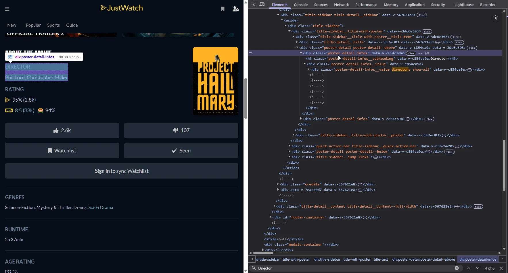

```html
<div class="poster-detail-infos" data-v-c854ca9a="">
  <h3 class="poster-detail-infos__subheading" data-v-c854ca9a="">Director</h3>
  <div class="poster-detail-infos__value" data-v-c854ca9a="">
    <div class="poster-detail-infos__value directors show-all" data-v-c854ca9a="">
      <span data-v-c854ca9a="">
        <span class="title-credit-name" data-v-60f15bf0="" data-v-c854ca9a="">Phil Lord</span>
      </span>
      <span data-v-c854ca9a="">", "
        <span class="title-credit-name" data-v-60f15bf0="" data-v-c854ca9a="">Christopher Miller</span>
      </span>
    </div>
  </div>
</div>
```

Looks like if we go top down with Director, we'll capture the `,`. Let's try going bottom up.

`title-credit-name` seems to be quite unique, let's try that since we know `span` is likely too generic. xpath `//span[@class="title-credit-name"]` or css `span.title-credit-name`. 22 results, it looks like it's also pulling in the cast. Let's scope it.

Above that is `<span data-v-c854ca9a="">`. Generic, lets head up another one.

```html
<div class="poster-detail-infos__value directors show-all" data-v-c854ca9a="">
```
looks promising, we notice that one of the classes included is directors. Let's try that. But since it's one class in many, we need to use a more elaborate xpath. `//div[contains(@class,"directors")]` or css `div.directors`. One result, let's use that to ground our selector.

`//div[contains(@class,"directors")]` + `//span[@class="title-credit-name"]`. In these cases we want to keep the `//` between them as there's an additional `<span>` in between. Our final selector returns two values, just what we want. Stash expects one value so let's use postprocess [`concat`](https://docs.stashapp.cc/in-app-manual/scraping/scraperdevelopment/#post-processing-options) to join them with a comma. Once again, underneath selector since we are doing postprocessing.

```yml
  Director:
    selector: //div[contains(@class,"directors")]//span[@class="title-credit-name"]
    concat: ", "
```

## Image
Image is one of the tricker ones, which you need to ensure your [JavaScript is disabled](#3-javascript). There are a lot of images on the page but it looks like the one we want is beside the directors. Instead of searching, right click the image and click "Inspect"

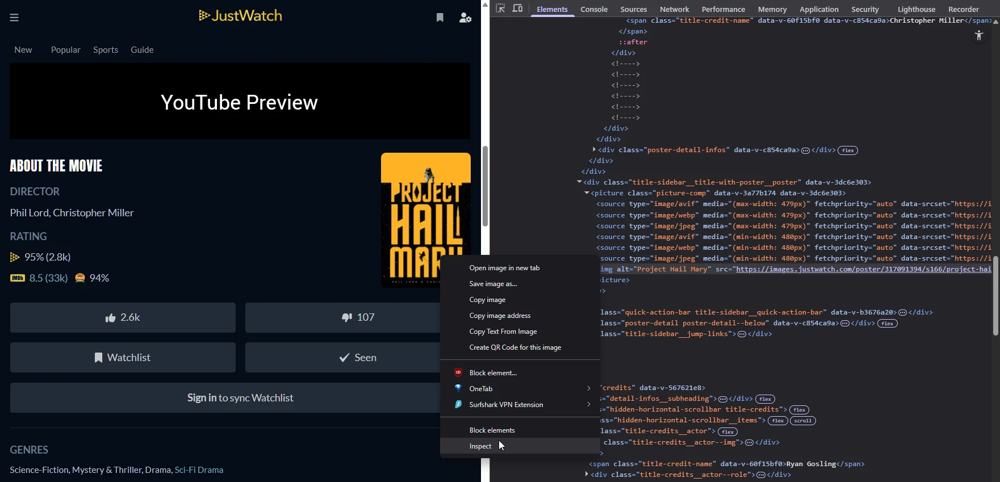

We can see the image is encapsulated with a `<picture>` this usually means it can load from multiple image types depending on browser to save on space. This makes things a bit more complicated. Let's see if there are any easier ways around that. Let's copy the domain out: from the url
```
https://images.justwatch.com/poster/317091394/s166/project-hail-mary.jpg
https://images.justwatch.com
```

and see if there might be any other easier or consistent accessability points. Throw that back into search and we discover our first [meta](#meta-tags) result, which is actually even higher quality (718x1024 instead of 166x236)

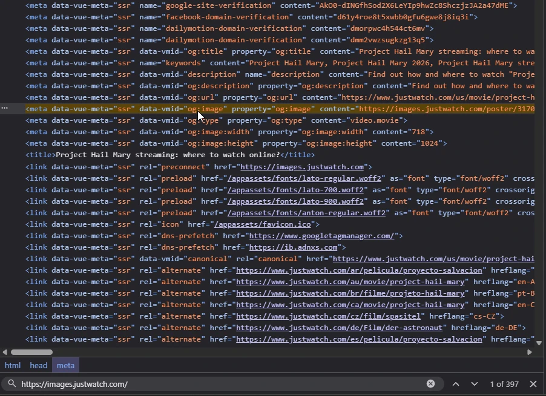

```html
<meta data-vue-meta="ssr" data-vmid="og:image" property="og:image" content="https://images.justwatch.com/poster/317091394/s718/project-hail-mary.jpg">
```

Just by looking at the surrounding properties we can see that `<meta data-vue-meta="ssr"...` is too common to use, but `og:image` seems to be unique enough, lets construct a selector to test. This is called an attribute, so let's reference the [cheat sheet](https://devhints.io/xpath).

```
input[type="submit"]	//input[@type="submit"]
```

xpath: `//meta[@property="og:image"]` or css `meta[property="og:image"]`. Since this isn't a textbox, when we actually put this in a scraper, we get nothing back. This is because we need to select the value of content="". Target the attribute name, `@content` by adding it on to the end of the scraper, after a `/`

```yml
  Image: //meta[@property="og:image"]/@content
```

## Performers
Performers tells us to reference the [Performer](https://docs.stashapp.cc/in-app-manual/scraping/scraperdevelopment/#performer) object. Let's focus on Name for now since it's the only one required.

Visual search brings us to the `Cast` block. Let's type in "Ryan Gosling" into search to see if anything else comes up. Just more ld+json and APOLLO_CACHE, let's just continue with the xpath scrapers

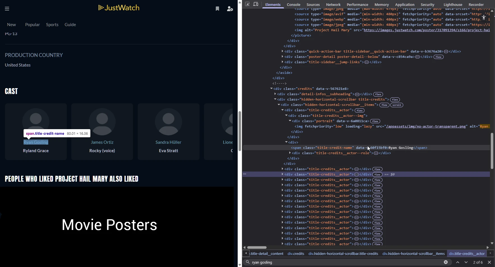

* Actor image intentionally nullified

We can see a bunch of these repeated
```html
<div class="title-credits__actor">
```
so it's probably important. Let's take one and inspect it.

```html
<div class="title-credits__actor">
  <div class="title-credits__actor--img">
    <div class="portrait" data-v-6a0811ca="">
      
    </div>
  </div>
  <div>
    <span class="title-credit-name" data-v-60f15bf0="">Ryan Gosling</span>
    <div class="title-credits__actor--role">
      <div class="title-credits__actor--role--name">
        <strong title="Ryland Grace">Ryland Grace</strong>
      </div>
    </div>
  </div>
</div>
```

We only want name so let's focus on the `title-credit-name`. We've seen `<span>` too many times, let's use the class of `title-credit-name`. 

xpath: `//span[@class="title-credit-name"]` or css: `span.title-credit-name`

Uh oh, same problem as with [directors](#director), we need to scop it to actors. Let's look at this suspiciously placed `title-credits__actor` and see if we can use the same logic as directors.

Create a selector for `title-credit__actors`, xpath: `//div[@class="title-credits__actor"]` or css `div.title-credits__actor`. We get 20 results so let's combine the two

`//div[@class="title-credits__actor"]` + `//span[@class="title-credit-name"]`

But since this is the name, we need to nest it

```yml
  Performers:
    Name: //div[@class="title-credits__actor"]//span[@class="title-credit-name"]
```

## Tags
For tags we'll pull genres instead since it's the closest equivalent.

Once again, search for "Genres". xpath, ld+json and APOLLO_CACHE all show up but we only care about xpath

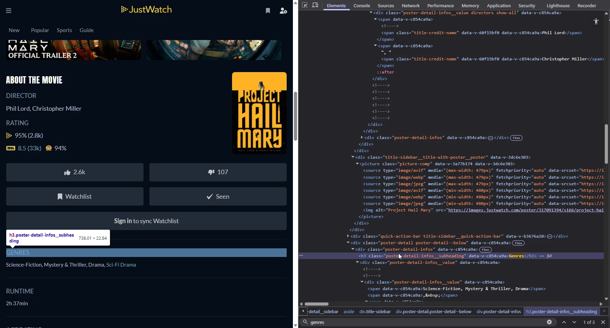

```html
<div class="poster-detail-infos" data-v-c854ca9a="">
  <h3 class="poster-detail-infos__subheading" data-v-c854ca9a="">Genres</h3>
  <div class="poster-detail-infos__value" data-v-c854ca9a="">
    <div class="poster-detail-infos__value" data-v-c854ca9a="">
      <span data-v-c854ca9a="">Science-Fiction, Mystery &amp; Thriller, Drama</span>
      <span data-v-c854ca9a="">,&nbsp;</span>
      <span data-v-c854ca9a="">
        <a href="/us/lists/sci-fi-drama/movies" class="detail-infos__value detail-infos__link" data-v-c854ca9a="">
          Sci-Fi Drama</a>
      </span>
    </div>
  </div>
</div>
```

for demo purposes we'll only target `Science-Fiction, Mystery &amp; Thriller, Drama` so we can use target selectors & split

`data-v-c854ca9a` seems to be common but volatile, let's look one above at `poster-detail-infos__value`. 13 results, we need to thin it out. Let's step down from `poster-detail-infos`. Nope, this returns with director and other similar blocks.

Taking the block above into account, we still run into similar issues since it's repeated a bunch. Bummer.

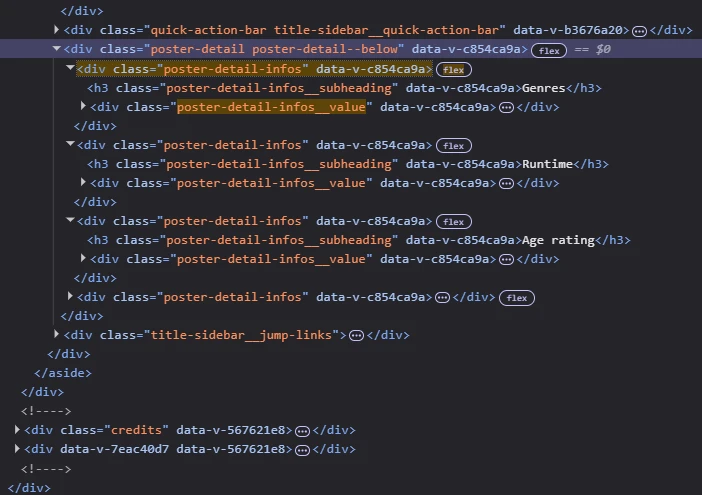

Looks like what's unique between them is Genres/ Runtime/ Age rating. So let's use those as selectors. Looking at [the cheat sheet](https://devhints.io/xpath), operators and predicates seem to be of interest. We can actually reference the text of a value with the `/text()` function

xpath: `//h3[contains(text(), "Genres")]` 

`contains()` is a function that checks if the value we specify is within the first. In this case, if "Genres" is within `text()`.

This selector returns one result, but this is beside the `post-detail-infos__value` that we want. There are to ways to select this, by going to the shared parent with `/..`, in this case then stepping down to `/div` `//h3[contains(text(), "Genres")]/../div` or by using a sibling selector. 

In this case we want the following sibling, `//h3[contains(text(), "Genres")]/following-sibling::div`. Both of these return one result which is exactly what we want

Going forward I'll use the parent selector, but either works. Taking a look back at our html

```html
<div class="poster-detail-infos" data-v-c854ca9a="">
  <h3 class="poster-detail-infos__subheading" data-v-c854ca9a="">Genres</h3>
  <div class="poster-detail-infos__value" data-v-c854ca9a="">
    <div class="poster-detail-infos__value" data-v-c854ca9a="">
      <span data-v-c854ca9a="">Science-Fiction, Mystery &amp; Thriller, Drama</span>
      <span data-v-c854ca9a="">,&nbsp;</span>
      <span data-v-c854ca9a="">
        <a href="/us/lists/sci-fi-drama/movies" class="detail-infos__value detail-infos__link" data-v-c854ca9a="">
          Sci-Fi Drama</a>
      </span>
    </div>
  </div>
</div>
```

We want the first `span` within `<div class="poster-detail-infos__value">`, so let's construct one on the end of our pervious selector which landed us at `<div class="poster-detail-infos__value" data-v-c854ca9a="">`

there's only one `/div` underneath, then let's stop down to `/span`. We want the first of three so let's specify the index of `[1]`. Quick sanity check with `//h3[contains(text(), "Genres")]/../div` + `/div/span[1]` lands us at the exact value we want.

Now that we have our selector, we need to extract the 3 genres from the one string. To do this we're going to use the [`split`](https://docs.stashapp.cc/in-app-manual/scraping/scraperdevelopment/#post-processing-options) post-processing option. 

`Science-Fiction, Mystery & Thriller, Drama` Since there is a space as well, we want to split on `, `. Again, since we are adding a postProcessing option, we need to nest it within `selector`

```yml
  Tags:
    Name:
      selector: //h3[contains(text(), "Genres")]/../div/div/span[1]
      split: ", "
```

## URL
URL can usually be pretty easy since the URL is provided. I'll split this into two parts - for grabbing the canonical link with `<meta>` and grabbing all the links to all the streaming services

### Canonical (justwatch)
From our browser, we already have the URL `https://www.justwatch.com/us/movie/project-hail-mary`. Let's chuck that into search. First result is
```html
<meta
  data-vue-meta="ssr"
  data-vmid="og:url"
  property="og:url"
  content="https://www.justwatch.com/us/movie/project-hail-mary">
```

good enough, let's look back on [meta](#meta-tags) or [image](#image) and just breeze on by with a similar xpath: `//meta[@property="og:url"]/@content`. One result, good enough.

```yml
  URLs: //meta[@property="og:url"]/@content
```

### All URLs (streaming services)
Since justwatch indexes all streaming services that offer it, let's grab all the urls that it has.

Let's start with one. Visual search leads us to the fandango box. Inspect element and let's see what's inside

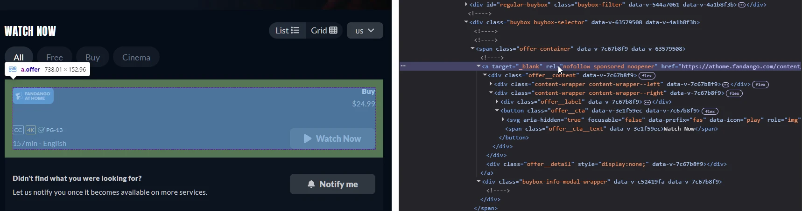

the `<a>` contains the link we're after

```html
<a
  target="_blank"
  rel="nofollow sponsored noopener"
  href="https://athome.fandango.com/content/browse/details/Project-Hail-Mary/4929485"
  class="offer"
  data-v-7c67b8f9="">
```

The URL (href) will differ, data-v seems to be internal or inconsistent, let's have a poke at the other values.

#### target="_blank"
xpath: `//a[@target="_blank"]` returns 7 results, all of which to streaming/ theater sites. Let's continue

```yml
  URLs: //a[@target="_blank"]
```

#### rel="nofollow sponsored noopener"
xpath `//a[@rel="nofollow sponsored noopener"]` only returns two, both to fandango. If we inspect one of the other links,

```html
<a
  target="_blank"
  rel="nofollow noopener"
  href="https://www.amctheatres.com/movies/project-hail-mary-76779"
  class="offer"
  data-v-7c67b8f9="">
```

we can see a lot of similarities but `rel="nofollow noopener"`. We can tweak our selector to use `contains()` instead

xpath: `//a[contains(@rel,"nofollow noopener")]`. Only 5 results, looks like fandango was dropped. Let's tweak to just `nofollow`

xpath: `//a[contains(@rel,"nofollow")]`. Back to 7, this is a decent alternative

```yaml
  URLs: //a[contains(@rel,"nofollow")]
```

#### class="offer"
Let's do a quick inspection

xpath: `//a[@class="offer"]`, css `a.offer`

7 results, we're good to go

```yml
  URLs: //a[@class="offer"]
```

# 3.0 Assembly
Now that we have our scraper values, let's plop them into a template

CommunityScrapers has pre-defined [templates](https://github.com/stashapp/CommunityScrapers/tree/master/templates) that cover 99% of values you need, let's grab [`SceneScraperTemplate.yml`](https://github.com/stashapp/CommunityScrapers/blob/master/templates/SceneScraperTemplate.yml) and go from there

Make sure to add in [debugging support](https://docs.stashapp.cc/in-app-manual/scraping/scraperdevelopment/#debugging-support)
```yml
debug:
  printHTML: true
```

```yml
name: JustWatch
sceneByURL:
  - action: scrapeXPath
    url:
      - justwatch.com/us/movie/
    scraper: sceneScraper
xPathScrapers:
  sceneScraper:
    scene:
      Title: //h1
      Details:
        selector: //div[@id="synopsis"]/article
        concat: \n\n\n
      Director:
        selector: //div[contains(@class,"directors")]//span[@class="title-credit-name"]
        concat: ", "
      URLs: //a[@class="offer"]
      Date:
        selector: //span[@class="release-year"]
        # no postProcess since we have a year only
        #postProcess:
        #  - parseDate: January 2, 2006
      Image: //meta[@property="og:image"]/@content
      Tags:
        Name:
          selector: //h3[contains(text(), "Genres")]/../div/div/span[1]
          split: ", "
      Performers:
        Name: //div[@class="title-credits__actor"]//span[@class="title-credit-name"]
debug:
  printHTML: true
```

Let's take our finished scraper and throw it in stash and see what happens! Make sure to hit "Reload Scrapers" in between changes, otherwise it'll continue to scrape with the old version.

Make sure the scraper is loaded by checking [/settings?tab=metadata-providers](http://localhost:9999/settings?tab=metadata-providers)

If we watch logs at [/settings?tab=logs](http://localhost:9999/settings?tab=logs) we'll also get not only all the scraped values but all the values scraped

Our result is

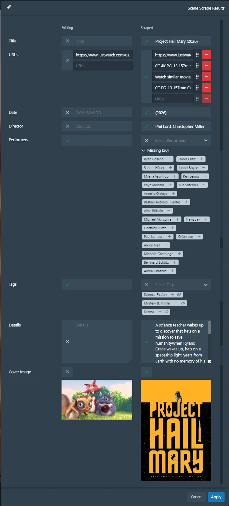

Checklist
- [ ] Title - we need to take the year off
- [ ] URLS - looks like we need to grab the `@href` instead of text
- [ ] Date - we need to remove `()`
- [x] Director
- [x] Performers
- [x] Tags
- [ ] Details - where are our newlines?
- [x] Cover

# 3.1 Debugging & iterating

## Title
We want to remove the year. First let's try using `/text()` to see if it is just pulling too much. Otherwise we can move on to regex.

`/text()` works, but

### regex
Here's how to fix it with regex, using [regexr](https://regexr.com/). vLet's paste in our title into the text box in the bottom. We want to remove ` (2026)`. ([state 1](regexr.com/8lib0) (populated link))

Let's start by just typing in exactly what we want to remove into the search pattern. ` (2026)`.
Inspecting the regex "explain" box we can see that `(` is a special character, so we can use `\(` to negate the special effects. This selects the text we want but we want to generalize it, say for `The Godfather (1972)` and `Inception (2010)` ([state 2](regexr.com/8lib3)).

Looking at the regex cheatsheet, we can see that `\d` represents all numbers. let's slot that in to make our pattern ` \(\d\d\d\d\)` ([state 3](regexr.com/8lib6)). At the bottom, there's also quantifiers for repeating, so instead of `\d` 4 times, we can just do `\d{4}` ([state 4](https://regexr.com/8lib9))

Perfect, let's check the docs for the [replace](https://docs.stashapp.cc/in-app-manual/scraping/scraperdevelopment/#post-processing-options) post processing option

we have to move the xpath down into `selector` now that we have postProcess. We put our new regex pattern in `regex` and for `with` we want to remove it so we put a blank string.

```diff
- Title: //h1
+ Title:
+   selector: //h1
+   postProcess:
+     - replace:
+       - regex:  \(\d{4}\)
+         with: ""
```

## URLs
Let's take our selector and see what it returns, and where all this is coming from.

```yml
//a[@class="offer"]
```


CC 4K PG-13 seems to be coming from this block, which means we're grabbing everything from the `<a>`. Let's tighten that up with a specific element selector like we did in [image](#image)

```diff
- URLs: //a[@class="offer"]
+ URLs: //a[@class="offer"]/@href
```

## Date
We want to change `(2026)` to `2026`
This can be accomplished with regex but instead of removing `(` and `)` let's get a bit more specific to only remove it from the beginning and end. Let's start with a blank slate, with the years from The Godfather and Inception in as well. ([state 1](regexr.com/8libc))

We know from previous regex that we need to escape `(`. After adding `\)` the pattern seems to have failed. This is because regex is looking for both of these in a row. Throw in a pipe (`|`) to act as an OR and we're set with `\(|\)` ([state 2](regexr.com/8libf)).

To ensure we only select the `(` at the start and the `)` at the end, we use the anchors - `^` for the beginning and `$` for the end. This makes `^\(|\)$`. If we populate this, it doesn't seem to work. That's because regex is only checking on one line. Add the flag `m` for multiline and you'll see it work it's magic ([state 3](regexr.com/8libi))

```diff
  Date:
    selector: //span[@class="release-year"]
+   postProcess:
+     - replace:
+       - regex: ^\(|\)$
+         with: ""
```

## Details
We added `\n` for newline but where did they go? Stash strips newlines as an automated cleanup, so we need to quote the newlines in double quotes to make sure they are passed in as-is

```diff
  Details:
        selector: //div[@id="synopsis"]/article
-       concat: \n\n\n
+       concat: "\n\n\n"
```

# 3.2 - Result
You can view the finished scraper with all fixes applied at [JustWatch.yml](./JustWatch.yml)